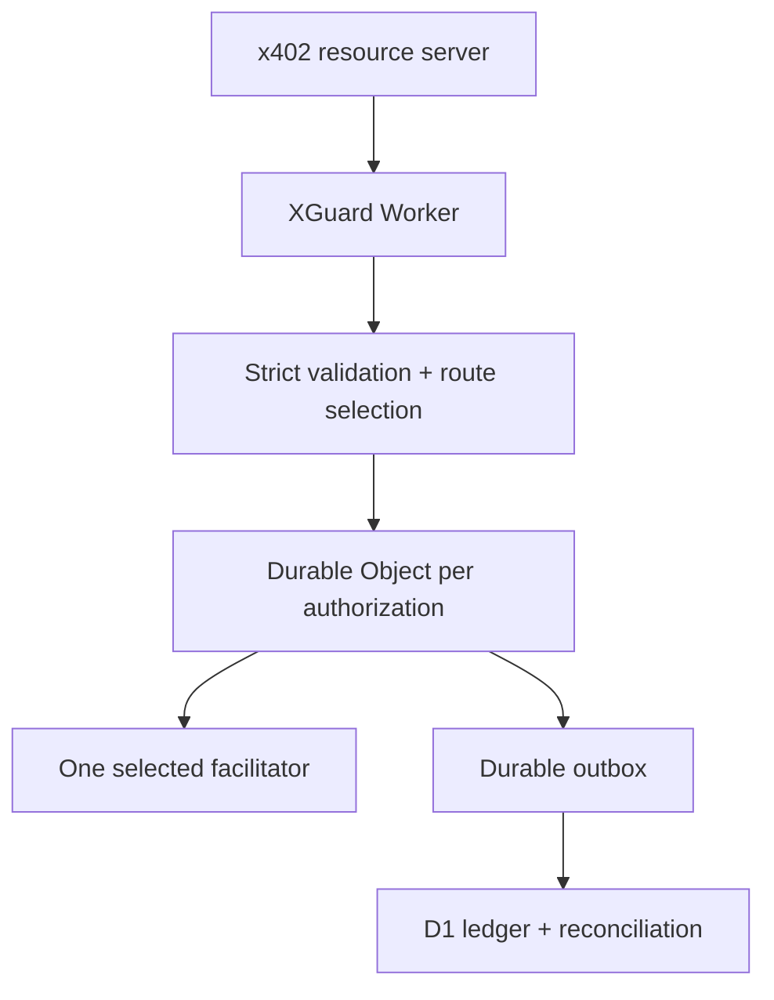

# Architecture

XGuard separates protocol validation, settlement serialization, operational projection, and reporting so a degraded reporting path cannot create a second onchain submission.

## Trust boundaries

1. **Public request boundary:** strict JSON parsing limits bytes, depth, key count, duplicate keys, dangerous prototype keys, schema shape, protocol version, amount, asset, recipient, network, expiry, and authorization mechanism.
2. **Authorization identity:** XGuard derives an immutable key from the EIP-3009 contract/owner/nonce domain or the Permit2 chain/owner/nonce bitmap domain. The official Payment Identifier remains a separate TTL retry key; it is not the permanent settlement identity.
3. **Settlement owner:** every immutable key maps to one SQLite-backed Durable Object. RPC calls serialize prepare/start/finalize transitions. At most one call can cross `OUTBOUND_STARTED`.
4. **Facilitator boundary:** configured HTTPS origins are trusted configuration, not request data. Node DNS resolution rejects non-public addresses; both runtimes reject redirects and bound response bodies. Conflicting, malformed, timed-out, or uncertain settle outcomes become `AMBIGUOUS`.
5. **Financial projection:** final Durable Object state and an outbox record commit in the same object transaction. D1 projection is idempotent and retried by an alarm; a D1 outage cannot authorize a second settlement.

## Two runtimes

| Runtime        | Purpose                                 | Financial storage                    | Current gate                                                       |
| -------------- | --------------------------------------- | ------------------------------------ | ------------------------------------------------------------------ |
| `apps/worker`  | Live zero-cash public testnet edge      | Durable Object truth + D1 projection | Deployed on Workers Free; Base Sepolia settlement confirmed        |
| `apps/gateway` | Portable reference and local operations | WAL/FULL-sync SQLite ledger          | Runs locally; PostgreSQL is required before multi-instance mainnet |

The Node store uses `BEGIN IMMEDIATE`, unique constraints, holds, immutable usage events, and balanced postings. SQLite is appropriate for the local/testnet reference, not a claim of safe multi-region mainnet operation.

## Routing

Verification candidates must match x402 version, scheme, network, capability, enabled state, and health. Verification can move to another route because it does not submit value. Settlement chooses once. Normal billable routing excludes a path when downstream or variable cost is unknown or when contribution would be negative.

States are `HEALTHY`, `DEGRADED`, `OPEN`, `HALF_OPEN`, `QUARANTINED`, and `DISABLED`. Scheduled probes can recover an open route; malformed financial responses quarantine it.

## Correctness guarantee

No distributed service can truthfully promise exactly-once blockchain execution across arbitrary network failures. XGuard instead enforces:

- at most one outbound settlement submission under XGuard control;
- one logical billing event per immutable payment key;
- no blind retry after the submission boundary;
- cached replay after a known final result;
- durable ambiguity plus reconciliation when the final result is unknown.

## Mainnet gate

Both shipped gateways reject mainnet in code. The reusable core additionally requires an enabled release and a registered independent chain-finality adapter before it can finalize or bill a mainnet success; no production adapter ships in this alpha. A post-submission mainnet rejection also remains ambiguous until independent evidence proves the authorization unused. The remaining legal and operational conditions are in [DEPLOYMENT.md](DEPLOYMENT.md).

The live Worker is deliberately limited to Base Sepolia, zero-fee accounting, and the configured testnet facilitator. Its successful testnet operation is evidence for the architecture, not permission to reuse testnet assumptions for mainnet.
