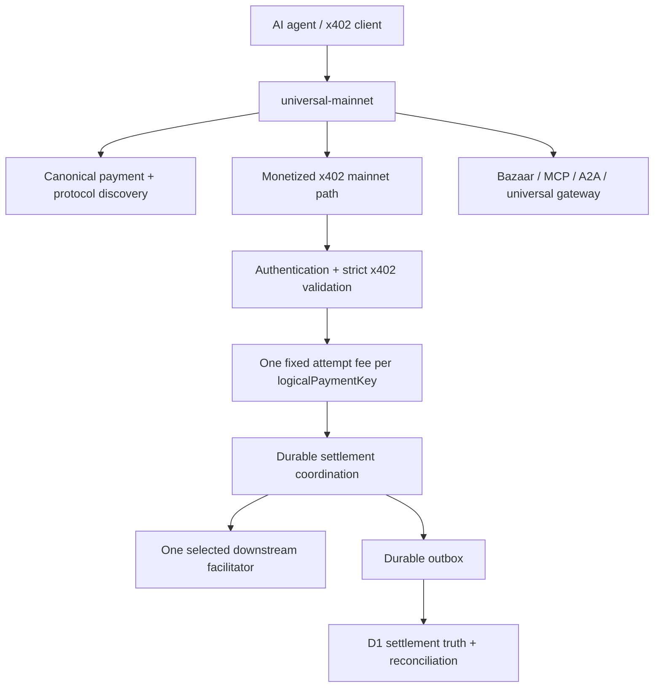

# Architecture

XGuard production runs on the `xguard-mainnet` Cloudflare Worker. The checked-in production entrypoint is `apps/worker/src/universal-mainnet.ts`, which composes public payment/protocol discovery with the monetized mainnet execution path and the modern settlement safety stack.

## Trust boundaries

1. **Public request boundary:** strict parsing and schema/network/asset constraints protect financial execution.
2. **Merchant boundary:** protected x402 execution requires the appropriate bearer scope before a request can become a chargeable accepted attempt.
3. **Billing identity:** the canonical `logicalPaymentKey` deduplicates the fixed **$0.03 / 30,000 micro-USD** x402 attempt fee. Verify → settle and retries for the same logical payment do not earn that fixed fee twice.
4. **Settlement owner:** every immutable payment identity maps to durable coordination so at most one call can cross the outbound settlement boundary under XGuard control.
5. **Facilitator boundary:** configured HTTPS origins are trusted configuration, not request data. Redirects and malformed/oversized responses are rejected where the financial path requires it. Uncertain settle outcomes become ambiguous rather than blindly retried.
6. **Financial projection:** D1 projects merchant balances, usage, settlement truth, finality and reconciliation with idempotent keys/constraints.
7. **Discovery boundary:** public Bazaar/MCP/A2A/provider metadata is kept separate from settlement correctness and from protected merchant execution.

## Runtime surfaces

| Surface | Purpose | Production role |
| --- | --- | --- |
| `apps/worker/src/universal-mainnet.ts` | Production composition layer | **Canonical `xguard-mainnet` Worker entrypoint** |
| `apps/worker/src/public-payment-contract.ts` | Canonical public price, billing event, network/asset and payment manifest | **Single public commercial-contract source** |
| `apps/worker/src/monetized-mainnet.ts` | Fixed x402 attempt-fee enforcement | Protected `/verify` and `/settle` accounting wrapper |
| `apps/worker/src/mainnet-modern.ts` | HTTPS/security, compatibility, universal gateway and settlement-truth integration | Modern protected execution layer |
| `apps/worker/src/mainnet-supervisor.ts` | Merchant authorization, upstream protection, recovery/maintenance | Production supervision around the financial core |
| `apps/worker/src/mainnet.ts` | Base mainnet settlement core | Durable settlement ownership + D1 finality/reconciliation |
| `apps/worker/src/index.ts` | Separate Base Sepolia worker | Manual, non-billable testnet only |
| `apps/gateway` | Legacy portable/local Node reference | Local/test operations; not the production mainnet entrypoint |

The mainnet Worker supports x402 v2 `exact` payments using native USDC on Base mainnet. Merchant service fees are separately disclosed and funded through the prepaid XGuard service balance; they are not silently deducted from the seller's advertised payment amount.

## Billing versus settlement truth

These are intentionally separate state machines:

- **Billing:** after authentication, supported-request parsing, `logicalPaymentKey` derivation and successful prepaid-balance reservation, XGuard earns the fixed x402 attempt fee before downstream execution.
- **Settlement truth:** after a settlement attempt crosses the outbound boundary, XGuard independently tracks whether the expected Base USDC transfer becomes `FINALIZED`, remains `PENDING`, is `PROVEN_FAILED`, or enters `CONFLICT`/reconciliation.

A downstream failure does not refund an already accepted attempt. An idempotent retry does not create another fixed attempt fee. Finality determines transfer truth; it is not the trigger for the canonical attempt fee.

## Settlement routing

Verification must match x402 version, scheme, network, capability, enabled state and health. Verification may use safe compatible routing because it does not submit value. Settlement chooses one outbound owner. XGuard does not blindly retry after the submission boundary.

Operational degradation and reconciliation remain fail-closed around value movement even though the accepted-attempt service fee is non-refundable after billing acceptance.

## Bazaar and agent discovery

The production composition exposes machine-readable discovery for humans, clients and agents, including payment manifests, provider metadata, OpenAPI, MCP, A2A and Bazaar resources/search. Free discovery **metadata** must not be confused with value-producing discovery/search operations, which can use their separate SOURCE fee schedule.

Catalog outages or malformed discovery metadata never authorize a second settlement submission.

## Correctness guarantees

No distributed service can truthfully promise exactly-once blockchain execution across arbitrary network failures. XGuard instead aims to enforce:

- at most one outbound settlement submission under XGuard control;
- one fixed x402 attempt fee per `logicalPaymentKey`;
- no second fixed fee for idempotent retry of that key;
- no blind settlement retry after the outbound boundary;
- durable ambiguity plus reconciliation when transfer truth is unknown;
- independent Base USDC finality for settlement truth;
- no x402 attempt fee for traffic rejected before authenticated economic acceptance.

Deployment applies D1 migrations before publishing the Worker and then runs release/live checks. External legal, provider and independent-review limitations remain documented in [DEPLOYMENT.md](DEPLOYMENT.md).
