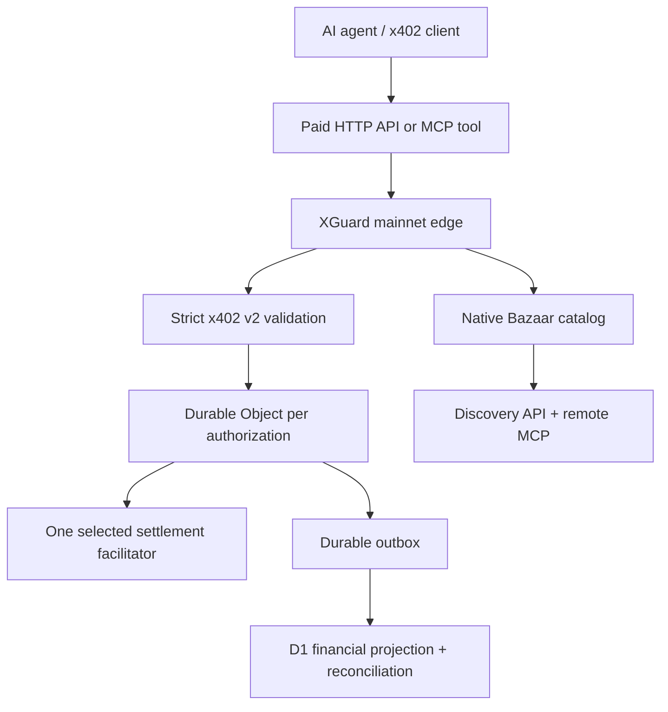

# Architecture

XGuard separates protocol validation, settlement serialization, discovery, operational projection, and reporting so a degraded non-financial path cannot create a second onchain submission.

## Trust boundaries

1. **Public request boundary:** strict JSON parsing limits bytes, depth, key count, duplicate keys, dangerous prototype keys, schema shape, protocol version, amount, asset, recipient, network, expiry, and authorization mechanism.
2. **Authorization identity:** XGuard derives an immutable key from the EIP-3009 contract/owner/nonce domain or the Permit2 chain/owner/nonce bitmap domain. The official Payment Identifier remains a separate TTL retry key; it is not the permanent settlement identity.
3. **Settlement owner:** every immutable key maps to one SQLite-backed Durable Object. RPC calls serialize prepare/start/finalize transitions. At most one call can cross `OUTBOUND_STARTED` under XGuard control.
4. **Facilitator boundary:** configured HTTPS origins are trusted configuration, not request data. Redirects and oversized responses are rejected. Conflicting, malformed, timed-out, or uncertain settle outcomes become `AMBIGUOUS`.
5. **Financial projection:** settlement state is durable before XGuard treats an outcome as final. D1 usage, finality, and reconciliation records are idempotent projections and cannot authorize a second settlement.
6. **Discovery boundary:** Bazaar metadata is untrusted public data. XGuard validates it against the supplied JSON Schema, sanitizes service metadata, requires public HTTPS resource URLs on mainnet, uses stable HTTP/MCP resource identities, and keeps catalog failure separate from settlement correctness.

## Runtime surfaces

| Surface | Purpose | Source of truth |
| --- | --- | --- |
| `apps/worker/src/index.ts` | Public Base Sepolia/testnet worker | Durable Object settlement truth + D1 projection |
| `apps/worker/src/mainnet.ts` | Base mainnet financial core | Durable Object settlement ownership + D1 billing/finality/reconciliation |
| `apps/worker/src/mainnet-edge.ts` | Mainnet discovery/MCP wrapper around the financial core | D1 Bazaar catalog; delegates all financial decisions to `mainnet.ts` |
| `apps/gateway` | Portable reference/local operations | WAL/FULL-sync SQLite ledger |

The mainnet Worker currently supports x402 v2 `exact` payments using native USDC on Base mainnet. Merchant service fees are separately disclosed and funded through the prepaid XGuard service balance; they are not silently deducted from the seller's advertised payment amount.

## Settlement routing

Verification must match x402 version, scheme, network, capability, enabled state, and health. Verification may fail over because it does not submit value. Settlement chooses once. XGuard does not blindly retry after the outbound submission boundary.

Operational states are `HEALTHY`, `DEGRADED`, `OPEN`, `HALF_OPEN`, `QUARANTINED`, and `DISABLED`. Scheduled probes can recover an open route; malformed financial responses quarantine it.

## Bazaar discovery

The mainnet edge implements the x402 Bazaar discovery role natively:

- successful verified x402 payloads with a valid `bazaar` extension may be cataloged;
- successful non-replayed settlements increment the resource's observed successful-settlement counter;
- MCP tools use `(resource URL, tool name)` as the stable catalog identity;
- `/discovery/resources` provides machine-readable catalog listing and filtering;
- `/discovery/search` provides bounded catalog search;
- `/mcp` exposes stateless remote discovery tools for agents;
- `EXTENSION-RESPONSES` reports Bazaar catalog success or rejection without changing the underlying settlement result.

Catalog outages or malformed discovery metadata never convert a valid settlement into a second submission. Financial correctness remains owned by the mainnet core.

## Correctness guarantee

No distributed service can truthfully promise exactly-once blockchain execution across arbitrary network failures. XGuard instead enforces:

- at most one outbound settlement submission under XGuard control;
- one logical billing event per immutable payment key;
- no blind retry after the submission boundary;
- cached replay after a known final result;
- durable ambiguity plus reconciliation when the final result is unknown;
- no XGuard fee earned for a definitive failure or duplicate cached replay.

## Mainnet safety gate

A mainnet settlement is not considered billable merely because the downstream facilitator returned success. XGuard persists a finality job and independently verifies the Base USDC transfer before moving held service fees to earned revenue. Uncertain post-submission outcomes remain ambiguous until reconciliation resolves them.

Deployment applies D1 migrations before publishing the Worker and then runs live health, capability, discovery, and MCP smoke tests. Legal and operational requirements remain documented in [DEPLOYMENT.md](DEPLOYMENT.md).
