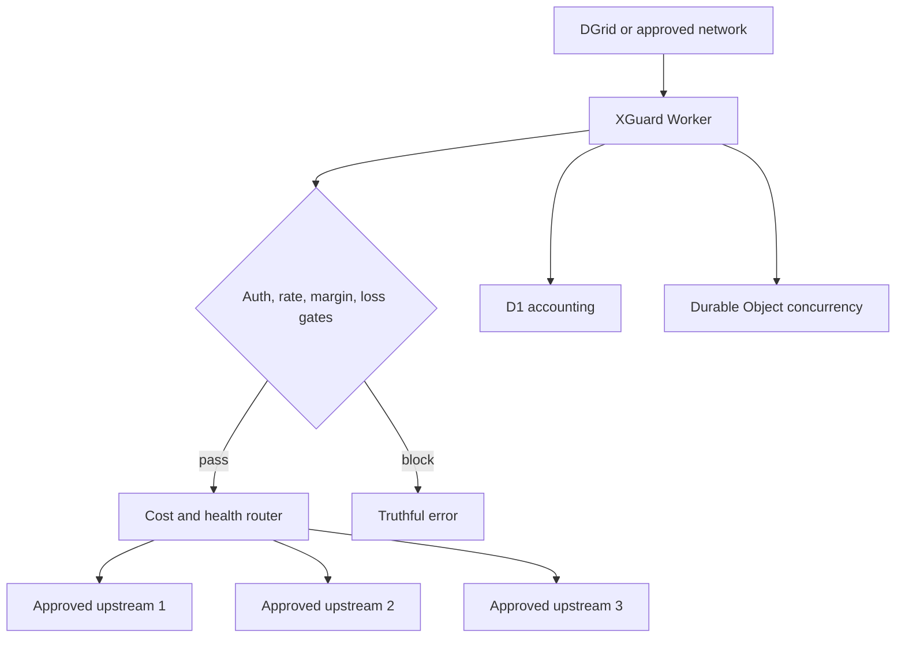

# Architecture

XGuard is an edge control plane around resale-approved or self-hosted inference capacity. Cloudflare handles ingress and state coordination; upstream compute performs model execution.

## Request lifecycle

1. The Worker authenticates the network bearer credential and enforces per-client and global limits.
2. It validates the OpenAI-compatible envelope without storing prompt or output content.
3. D1 supplies eligible models, prices, latest health, cost history, and daily loss state.
4. The profit guard estimates the maximum completion cost before any paid upstream call.
5. A model-scoped Durable Object grants a short concurrency lease.
6. The router orders healthy routes by cost, reliability, and latency and fails over on retryable upstream failures.
7. Non-streaming responses use provider-reported token usage when available. Streaming responses are teed: one branch reaches the caller while the accounting branch reads only SSE usage frames.
8. Actual or conservatively estimated cost is recorded. Revenue remains `PENDING` until settlement evidence exists.

## State ownership

| Component      | Responsibility                                                                               |
| -------------- | -------------------------------------------------------------------------------------------- |
| Worker         | authentication, schema validation, forwarding, streaming, security headers                   |
| Durable Object | model-scoped concurrency leases with expiry cleanup                                          |
| D1             | networks, routes, health, requests, costs, revenue, settlement, payout, profit, optimization |
| Cron           | hourly health checks and six-hour optimization                                               |
| Upstream       | model execution under separately approved commercial authority                               |

No Queue is provisioned in the initial release because there is no asynchronous workload that justifies its fixed operational complexity. Cron and D1 are sufficient; a Queue can be added when an official DGrid settlement or usage event contract exists.

## Fail-closed rules

- Missing network or admin secrets never produce open access.
- Missing legal evidence, upstream cost, network fee, variable infrastructure cost, sale price, health, or upstream credential disables the route.
- Unknown DGrid provider-channel and payout contracts remain `UNVERIFIED` / `NOT_SUPPORTED`.
- Daily net profit counts `SETTLED` revenue only.
- The payout destination is read only from `XGUARD_PAYOUT_DESTINATION`; it is never stored or returned.
