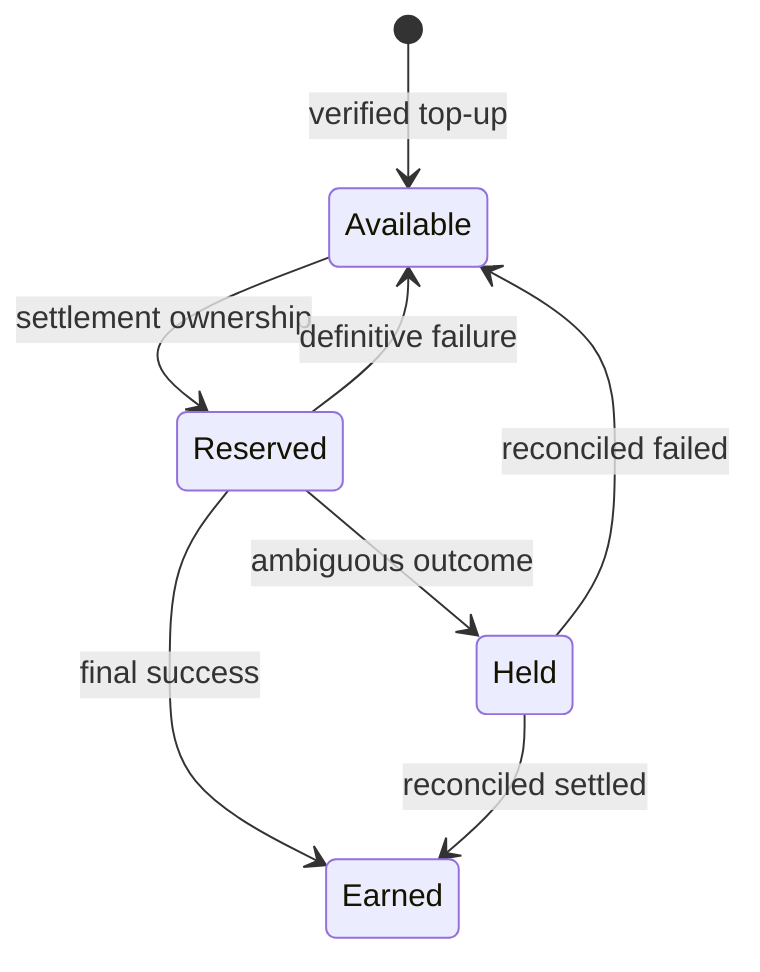

# Billing

## Model

Current x402 does not provide a generic, transparent field that lets an independent routing facilitator divert an additional service fee without changing the merchant's advertised payment terms. Builder Code is attribution rather than fee collection. XGuard therefore implements a separately disclosed prepaid merchant service balance. See [the protocol research](docs/PROTOCOL_RESEARCH.md#fee-collection-conclusion).

Billable money is stored as `bigint` integer micro-USD in the Node financial source of truth. The Worker uses JavaScript safe integers only for a hard-coded testnet projection whose effective fee and downstream cost are always zero; it is not a mainnet or billable ledger.

## Invariants

- A unique logical payment can create at most one `SUCCESSFUL_BILLABLE_SETTLEMENT` usage event.
- Testnet always has an effective fee of zero.
- A duplicate that returns a cached settlement creates neither a new hold nor a new fee.
- A definitively failed testnet settlement or independently proven unused mainnet authorization releases its hold and creates no revenue. A post-submission mainnet rejection alone is not definitive.
- An ambiguous settlement is not billed until final evidence resolves it.
- Usage history is immutable. Refunds, credits, or corrections are new compensating entries.
- Top-ups are idempotent by external reference and may be credited only after provider funds are final.

## Balance experience

The gateway returns a payment-required error before submission when the merchant's service balance cannot cover the configured fee. A production connector can expose balance, low-balance threshold, and top-up status through authenticated APIs. Auto-top-up may be enabled only after the merchant explicitly authorizes a funding source and limit; no funding instrument is inferred or charged without authorization.

The initial release contains the ledger and policy but no live top-up provider. This keeps bootstrap at zero owner cost and prevents simulated credits from being treated as real funds.
