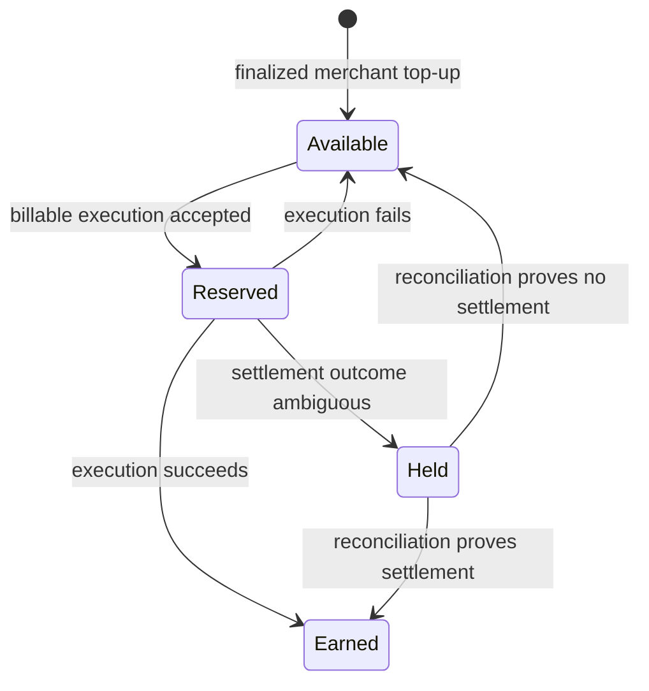

# Billing

## Model

XGuard is a prepaid, per-successful-execution gateway. It does not silently divert money from a merchant's advertised payment. Service fees are separately disclosed and deducted from the merchant's prepaid XGuard service balance.

Production pricing is configured in `apps/worker/wrangler.mainnet.jsonc`.

Current mainnet prices:

| Event | Fee |
| --- | ---: |
| Model proxy execution | $0.0001 |
| Tool proxy execution | $0.0002 |
| x402 verification execution | $0.0002 |
| Source discovery/search | $0.0010 |
| Security inspection | $0.0010 |
| Analysis/ranking | $0.0020 |
| Successful finalized x402 settlement | $0.0020 |

Merchant top-ups are prepaid service liabilities; they are not revenue when deposited.

## Free surface

The following remain free because they are discovery, readiness, or protocol metadata rather than value-producing execution:

- `GET /`
- `GET /healthz`
- `GET /readyz`
- `GET /supported`
- well-known discovery documents
- MCP `server/discover`
- MCP `tools/list`
- MCP `ping`
- MCP `xguard_status`

## Billable surface

Successful execution is billable when it consumes XGuard execution value:

- `POST /verify`
- `POST /v1/gateway/proxy/...`
- `POST /v1/gateway/sources/search`
- `POST /v1/gateway/analyze`
- `POST /v1/gateway/security/inspect`
- MCP `tools/call` except the explicitly free `xguard_status` tool
- successful finalized `POST /settle`

MCP `xguard_discover` and `xguard_resource_details` are billed as SOURCE events. Future MCP execution tools default to TOOL billing unless classified more specifically.

## Accounting state machine

For gateway, MCP, and verify executions, XGuard reserves the configured fee before execution and earns it only after a successful result. Failed, malformed, rejected, or unavailable operations release the reservation.

For x402 settlement, XGuard continues to use the stricter finality model: downstream success alone is not enough. The settlement fee becomes earned only after independent finalized Base USDC evidence.

## Mainnet implementation

The live Cloudflare Worker maintains merchant billing state in D1 and coordinates settlement ownership with Durable Objects.

Authenticated merchant endpoints:

- `POST /v1/register`
- `GET /v1/balance`
- `POST /v1/topups/intents`
- `POST /v1/topups/claim`

A top-up intent returns an exact native Base USDC amount and the configured XGuard treasury address. The merchant sends that exact amount, then claims the deposit using the transaction hash and one-time claim token. XGuard independently verifies the finalized Base USDC transfer before crediting the service balance.

No simulated credit is accepted as a production top-up.

## Billing invariants

- No billable execution runs when the prepaid service balance cannot cover its configured fee.
- A successful gateway/MCP/verify execution creates at most one earned usage event for a request id.
- Failed execution releases the reserved fee.
- Duplicate settlement retries do not create a second settlement fee.
- Settlement revenue is recognized only after independent finalized Base USDC evidence.
- Merchant top-up deposits are not counted as XGuard revenue.
- Testnet traffic remains non-billable unless explicitly changed in the testnet configuration.
- Usage history is immutable; corrections use compensating accounting entries rather than destructive edits.

## Insufficient balance

A billable request without enough available service balance fails closed with HTTP `402` and `xguard_service_balance_required` / `insufficient_service_balance` semantics. The response identifies the required fee and the top-up path when available.

The protected operation is not intentionally executed downstream when reservation fails.

## Settlement ambiguity and reconciliation

Once an outbound blockchain settlement submission has started, XGuard does not blindly retry through another route. Network timeouts or uncertain downstream outcomes enter an ambiguous state. The reserved settlement fee remains held until independent evidence resolves whether the payment settled.

This prevents duplicate blockchain submission and prevents revenue recognition that has not been proven earned.

## Auto-top-up

XGuard does not infer or charge a merchant funding instrument automatically. Any future auto-top-up mechanism must require explicit merchant authorization, funding limits, and a separately auditable provider integration.
