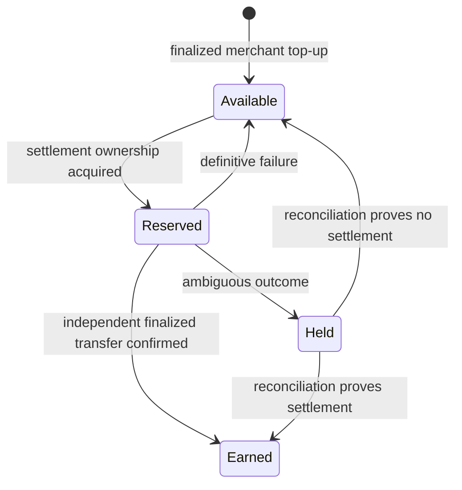

# Billing

## Model

XGuard does not silently divert money from the merchant's advertised x402 payment. The XGuard service fee is separately disclosed and charged against a prepaid merchant service balance.

Production mainnet pricing is configured as **$0.002 per successful billable settlement**. Merchant top-ups are prepaid service liabilities; they are not revenue when deposited.

## Mainnet implementation

The live Cloudflare Worker maintains merchant billing state in D1 and coordinates settlement ownership with Durable Objects.

Mainnet exposes authenticated merchant endpoints:

- `POST /v1/register`
- `GET /v1/balance`
- `POST /v1/topups/intents`
- `POST /v1/topups/claim`

A top-up intent returns an exact native Base USDC amount and the configured XGuard treasury address. The merchant sends that exact amount, then claims the deposit using the transaction hash and one-time claim token. XGuard independently verifies the finalized Base USDC transfer before crediting the service balance.

No simulated credit is accepted as a production top-up.

## Billing invariants

- One logical payment can create at most one successful billable usage event.
- A duplicate cached settlement creates neither a second hold nor a second fee.
- Failed verification creates no fee.
- A definitive failed settlement releases the reserved fee.
- A post-submission ambiguous outcome is not earned revenue until reconciliation/finality proves settlement.
- Successful downstream submission alone is not enough to earn the fee; independent finalized Base USDC evidence is required.
- Merchant top-up deposits are not counted as XGuard revenue.
- Usage history is immutable; corrections are represented by compensating entries rather than destructive edits.
- Testnet traffic remains non-billable.

## Insufficient service balance

Before an outbound billable settlement is started, XGuard reserves the configured service fee. If the authenticated merchant's available service balance cannot cover the fee, `/settle` fails closed with `xguard_service_balance_required` and does not intentionally submit the payment downstream.

The response includes the required fee, available balance, and the top-up-intent endpoint.

## Ambiguity and reconciliation

Once outbound submission has started, XGuard does not blindly retry through another route. Network timeouts or uncertain downstream outcomes enter an ambiguous state. The reserved service fee remains held until independent evidence resolves whether the payment settled.

This prevents both duplicate blockchain submission and recognition of revenue that has not been proven earned.

## Auto-top-up

XGuard does not infer or charge a merchant funding instrument automatically. Any future auto-top-up mechanism must require explicit merchant authorization, funding limits, and a separately auditable provider integration.
