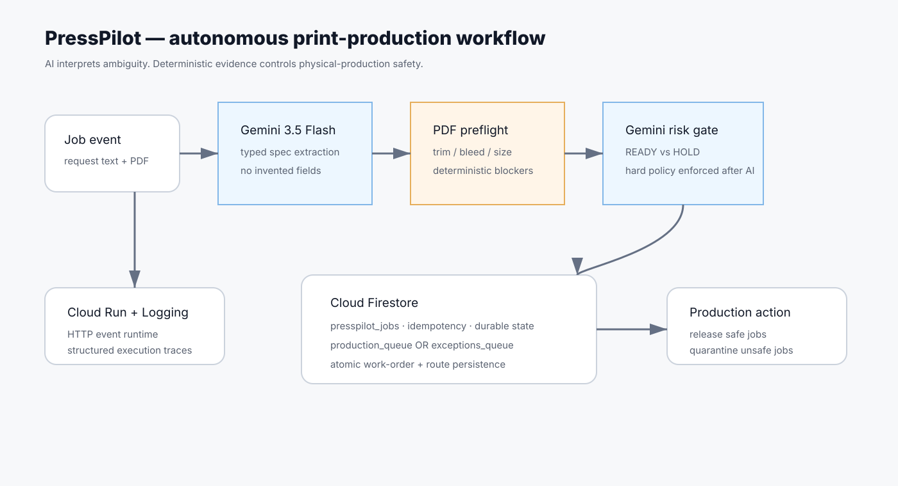

# TrimGate

**An autonomous print-production gatekeeper built for the 2026 All Things Agentic Hackathon — Taskmaster track.**

Press shops routinely receive production instructions as messy email/WhatsApp prose plus artwork files. A production manager has to translate that prose into manufacturing specs, inspect the PDF, reconcile mismatches, and decide whether a job is safe to release. TrimGate turns that multi-step manual choke point into an event-driven agentic workflow.

## What it does

1. **Intake agent** — Gemini 3.5 Flash converts an unstructured customer request into a typed manufacturing spec without inventing missing fields.
2. **Deterministic preflight** — Python inspects the PDF's geometry, page count, trim/bleed boxes and compares finished size against the extracted spec.
3. **Risk gate agent** — Gemini 3.5 Flash synthesizes the structured spec and machine evidence into a concise production decision while hard safety rules prevent an LLM from overriding deterministic blockers.
4. **Action layer** — the finished work order is persisted in Firestore and automatically routed to either `production_queue` or `exceptions_queue`.
5. **Idempotency + audit trail** — repeated webhook deliveries do not duplicate work orders; every stage emits structured trace events suitable for Cloud Logging.

This is not a chat loop. The input is a job event; the output is a persisted, routed production action.

## Why this problem

This is a Bring Your Own Friction project based on real print-production workflow: job instructions arrive in inconsistent language while artwork geometry is objective. The costly failure mode is not a bad answer — it is printing the wrong thing. TrimGate deliberately combines AI interpretation with deterministic gates so autonomous execution remains safe.

## Google technology

- **Gemini 3.5 Flash** (`gemini-3.5-flash`) for structured intent extraction and agentic production reasoning.
- **Google GenAI SDK** (`google-genai`) as the required Google agent framework.
- **Google Cloud Run** for the event-driven API and live UI.
- **Cloud Firestore** for durable work-order state, idempotency and queue documents.
- **Cloud Logging** receives the service's structured JSON execution traces from Cloud Run.

## Architecture



The safety boundary is intentional: Gemini may interpret ambiguous human intent, but deterministic PDF evidence wins when there is a conflict.

## Reproducible local run

Python 3.12 recommended.

```bash
python -m venv .venv
source .venv/bin/activate      # Windows: .venv\\Scripts\\activate
pip install -r requirements-dev.txt
cp .env.example .env
export GEMINI_API_KEY="YOUR_KEY"
export TRIMGATE_STORAGE=memory
uvicorn app:app --reload --port 8080
```

Open `http://localhost:8080` and click **Run autonomous demo**. The demo generates an A4 PDF in memory and submits it against an A5 request; the agent should route the job to `exceptions_queue` with a `SIZE_MISMATCH` blocker.

Run the tests (deterministic preflight, fail-closed policy, and an end-to-end workflow/idempotency contract test):

```bash
PYTHONPATH=. TRIMGATE_STORAGE=memory pytest -q tests
```

## Deploy to Google Cloud Run

Prerequisites: a Google Cloud project with billing enabled and `gcloud` authenticated. The deployment script creates/updates the Gemini secret, creates a least-privilege runtime service account, enables the required APIs, and creates the default Firestore Native database if needed.

```bash
export GOOGLE_CLOUD_PROJECT="your-project-id"
export GOOGLE_CLOUD_REGION="us-central1"
./deploy.sh
```

Cloud Run source deployment builds the container, scales to zero when idle, and returns a public `.run.app` URL. The script also enables Firestore and configures the production storage backend.

The runtime service account is granted only `roles/datastore.user`; Secret Manager access is scoped to the `trimgate-gemini-key` secret with `roles/secretmanager.secretAccessor`.

## API

### `POST /api/jobs`
Multipart fields:
- `customer_name`
- `request_text`
- optional `artwork` PDF (15 MB demo limit)

### `POST /api/demo`
Runs the bundled failure scenario end-to-end.

### `GET /api/jobs/{job_id}`
Returns the durable work order.

### `GET /health`
Health and configured model.

## Failure handling

- Missing size or quantity creates a deterministic blocker.
- Unreadable or missing artwork blocks release.
- PDF trim-size mismatch blocks release.
- The LLM cannot override a blocker: a post-model safety check enforces `HOLD`.
- Firestore batches the job and queue document in one commit.
- Content-derived idempotency prevents duplicate orders caused by webhook retries.
- Local development uses in-memory storage only when `TRIMGATE_STORAGE=memory` is explicit; production Firestore errors fail closed rather than silently losing durable state.

## Hackathon disclosure

TrimGate was created during the All Things Agentic Hackathon submission period. It is a new project and does not reuse XGuard source code. General-purpose open-source libraries listed in `requirements.txt` are used under their respective licenses.

## License

MIT — see `LICENSE`.
