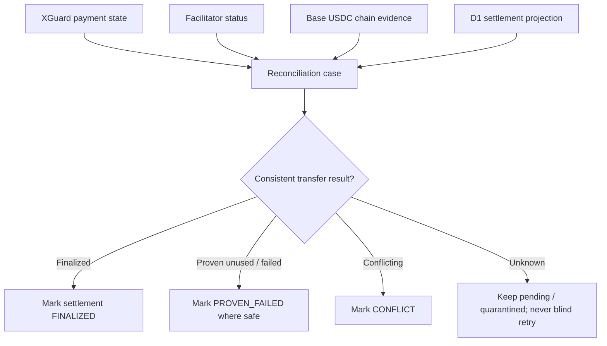

# Reconciliation

Reconciliation compares independent settlement evidence rather than trusting one database or one provider response. It governs **transfer truth and safe retry/release decisions**; it does not retroactively decide whether the canonical x402 accepted-attempt fee was earned.

## Billing boundary

The canonical public x402 fee is **$0.03 / 30,000 micro-USD once per accepted authenticated economic attempt**. It is earned after merchant authentication, supported-request parsing, canonical `logicalPaymentKey` derivation and successful prepaid-balance reservation, before downstream execution.

Therefore:

- a downstream verification/settlement failure does not refund an already accepted attempt;
- verify → settle or a retry with the same logical payment key does not add a second fixed attempt fee;
- malformed or unauthenticated traffic rejected before acceptance does not earn the fixed attempt fee;
- reconciliation must never create a second attempt-fee event for the same `logicalPaymentKey`.

Historical settlement-hold/finality records may still exist in D1 from earlier accounting paths. Those records must be reconciled according to their recorded event type; they must not be reinterpreted as new canonical attempt fees.

## Implemented settlement-truth checks

- turn stale `OUTBOUND_STARTED` records into `AMBIGUOUS` rather than retry them;
- expire never-submitted `OUTBOUND_PREPARED` records according to the settlement-state rules;
- verify ledger transactions and durable projections according to their event type;
- enforce unique payment/usage identities and non-billable testnet behavior where configured;
- require attributable finality evidence before declaring a Base USDC settlement `FINALIZED`;
- require strong unused-authorization/non-settlement evidence before declaring an ambiguous transfer safely failed;
- preserve a pending/conflict state when evidence is insufficient;
- project terminal settlement events through idempotent durable state/outbox mechanisms.

## Resolution rules

`PENDING` or `AMBIGUOUS` never means failed. The same authorization is not blindly resubmitted. Resolution requires durable, attributable evidence:

- proven expected Base USDC transfer → `FINALIZED`;
- proven safe non-settlement / unused authorization → `PROVEN_FAILED`;
- conflicting evidence → `CONFLICT`;
- insufficient evidence → remain pending/ambiguous.

Settlement truth is exposed independently through `/v1/settlements/{logicalPaymentKey}/truth` and the corresponding resolve path. The truth state answers **whether the expected transfer occurred**, not **whether the earlier accepted service attempt was billable**.

## External comparisons

Any comparison against provider account statements, external treasury balances, off-ramp/bank returns or signed third-party webhooks must be described as implemented only when the corresponding live connector and evidence path actually exist. Documentation must not convert planned controls into claims of running automation.

## Invariant

Reconciliation may repair/prove settlement state, but it must never:

1. submit a second transfer merely because a prior outcome is uncertain;
2. create a second fixed attempt fee for the same `logicalPaymentKey`; or
3. refund the canonical non-refundable attempt fee solely because downstream execution later failed.
