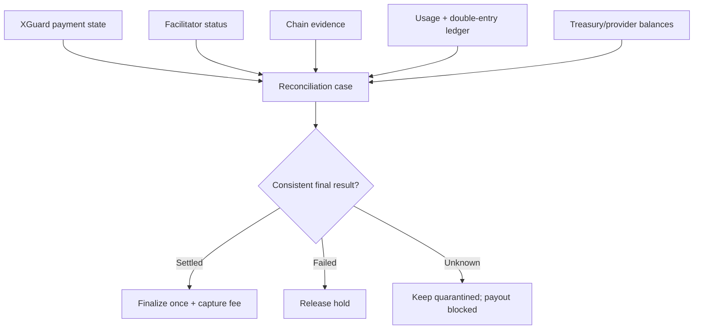

# Reconciliation

Reconciliation compares independent evidence rather than trusting one database or one provider response.

## Implemented automated checks

- turn stale `OUTBOUND_STARTED` records into `AMBIGUOUS` rather than retry them;
- expire never-submitted `OUTBOUND_PREPARED` records and release their holds;
- verify each ledger transaction balances to zero;
- enforce unique usage/payment keys and zero effective testnet fees in transactional code and database constraints;
- require typed, fully bound finality evidence before direct or reconciled success can capture a mainnet fee;
- require typed unused-authorization evidence before an ambiguous mainnet payment can release its hold;
- suspend payout for an imbalanced ledger, any open/quarantined settlement, or an ambiguous earlier payout;
- project Worker terminal events through an idempotent durable outbox.

The portable Node command `npm run ops:reconcile` currently performs stale/prepared recovery, double-entry balance verification, ambiguity counting, and a financial/payout-suspension report. The Cloudflare cron currently probes facilitator capabilities, removes expired Payment Identifier claims, and opens a case for a D1 ledger imbalance. Final Durable Object state and its outbox record commit together; alarms retry only the idempotent D1 projection, so a D1 outage cannot reopen the outbound settlement boundary.

## Required before mainnet automation

The following comparisons are designed and represented by fail-closed interfaces, but no live connector exists yet: facilitator status versus chain receipt/effect, merchant liability versus external top-up provider, treasury versus final provider balance, signed/deduplicated off-ramp webhooks, bank returns, and alert delivery. Documentation must not describe those external comparisons as currently running.

## Resolution rules

`AMBIGUOUS` never means failed. The same authorization is not resubmitted. Resolution requires durable, attributable evidence. A proven success finalizes once and creates at most one usage event; a proven non-settlement releases the hold. Conflicting or insufficient evidence keeps the case open and suspends owner payout.

The current alpha has reconciliation state, local balance checks, typed evidence boundaries, and adversarial fixtures. A mainnet release additionally requires implemented provider/facilitator adapters, independent chain confirmation for every enabled network/asset, signed and replay-safe webhooks, external balance comparisons, and alert delivery.
